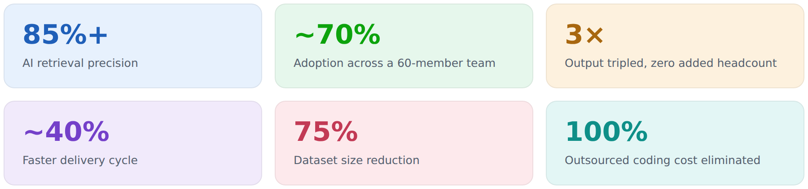
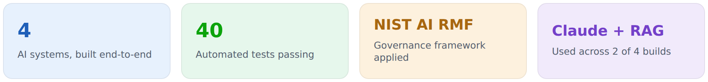

### Hi, I'm Neeti - Decision Intelligence | AI Strategy

I bring research-grade rigor to AI Strategy and Digital Transformation with hypothesis led approach, measurement-first thinking, and feasibility analysis to explore how emerging technologies can create meaningful business value.

My approach draws on 14+ years across research, insights, data, and program leadership, with a focus on connecting business problems, evidence, technology, and outcomes.

This GitHub reflects how I think and work: exploring ideas, building, testing, and translating AI concepts into practical approaches.

---

#### ⚡ Executive Snapshot

<picture>
  <source media="(prefers-color-scheme: dark)" srcset="assets/exec_snapshot_dark.png">
  
</picture>

---

#### A Research-Driven Approach to AI

My approach combines hypothesis-led thinking, measurement-first design, and feasibility analysis-bringing research-grade rigor to AI strategy and increasing the likelihood that AI initiatives translate into measurable business impact.

- **Problem before technology** - Define the business problem and decision first.
- **Hypothesis-led design** - Frame use cases around clear hypotheses and value drivers.
- **Measurement-first** - Define success metrics and measurement frameworks upfront.
- **Feasibility before scale** - Assess data, technology, operating model and adoption feasibility early.
- **Test, validate, iterate** - Validate AI performance and business impact before scaling.

---

#### 🏛️ Enterprise AI Systems

🔍 [**Enterprise Research AI Platform**](https://github.com/NeetiChandra/enterprise-research-ai-platform)
Retrieval-augmented research platform unifying 6 differently-structured data sources into one AI-ready pipeline, with reliability-weighted retrieval so a single opinion is never trusted like a validated benchmark — 85%+ retrieval precision, full data lineage at go-live.
`RAG Architecture` `Data Governance` `Multi-Source Integration`

📊 [**Self-Service Demand Analytics**](https://github.com/NeetiChandra/self-service-demand-analytics)
Self-service dashboard replacing multi-day manual data requests, built on a standardised 40,000+ term taxonomy — cut downstream dataset size by 75%, changed how research priorities get set.
`Demand Analytics` `Taxonomy Design` `Self-Service BI`

🧠 [**NLP Thematic Coding Engine**](https://github.com/NeetiChandra/nlp-thematic-coding-engine)
In-house NLP platform replacing outsourced qualitative coding — themes, entities, and sentiment extracted from unstructured text with domain context retained. Eliminated 100% of external coding cost.
`NLP` `Thematic Analysis` `Cost Elimination`

🤖 [**Agentic Research Commissioning Tool**](https://github.com/NeetiChandra/agentic-research-commissioning-tool)
Agentic AI tool keeping client context intact from intake through to delivery, weighting stakeholder input by domain relevance — a first-of-its-kind build for its programme.
`Agentic AI` `Research Ops` `Stakeholder Weighting`

📈 [**Executive Intelligence Systemisation**](https://github.com/NeetiChandra/executive-intelligence-systemisation)
A manual, inconsistent monthly intelligence product re-engineered into a systemised production model — 30+ standardised themes, plus a dashboard and AI chatbot layered on top. Tripled output, zero added headcount.
`Process Design` `AI-Enabled Publishing` `Adoption Measurement`

🌐 [**Voice-of-Customer Analytics Transformation**](https://github.com/NeetiChandra/voice-of-customer-analytics-transformation)
Six analytical models turning noisy customer-review data across 250+ markets into a trusted commercial product — ~40% faster delivery cycle, became the firm's top sales-enablement asset within 12 months.
`VoC Analytics` `Analytical Architecture` `Commercial Design`

---

#### Featured builds

[AI Adoption Scorecard](https://github.com/NeetiChandra/ai-adoption-scorecard) Turns AI-rollout usage logs into board-ready metrics - adoption rate, hours saved, satisfaction, department-level gaps - plus an auto-generated executive narrative. Python · fully tested, zero external dependencies to render.

[Executive Decision Brief Generator](https://github.com/NeetiChandra/exec-decision-brief) Turns unstructured inputs (financials, stakeholder feedback, contracts, compliance reviews) into a one-page decision memo with a recommendation, risk list, and an honest confidence score — the recommendation is computed deterministically, the LLM only writes the prose. Claude API, RAG-style synthesis, Python.

[AI Tool Evaluation & Governance Rubric](https://github.com/NeetiChandra/ai-tool-governance-rubric) A weighted scoring framework for comparing AI vendor tools on use-case fit, cost, and governance - grounded in the NIST AI RMF's four functions - where a failed compliance gate overrides the ranking, not just flags it. Python.

[PolicyBot](https://github.com/NeetiChandra/policybot) A retrieval-augmented chatbot answering HR policy questions from source documents - applying the same build-and-adopt pattern outside a research context. Python, RAG.

<picture>
  <source media="(prefers-color-scheme: dark)" srcset="assets/snapshot_dark.png">
  
</picture>

---

#### Toolset

---

📫 Let's connect on [LinkedIn](https://www.linkedin.com/in/REPLACE_WITH_LINKEDIN_HANDLE/) · [neeti.chandra99@gmail.com](mailto:neeti.chandra99@gmail.com)
